# 键盘布局设计

周末被推送的某键盘软文震了一下。一个68键的产品，定价999。此时市面上一个知名品牌的87键键盘，售价约300。小众粉圈的钱也最好赚的。

两年前做过调研，有一个设计。当时犹豫自己做，有些点隐去了。现在想想，格局真小。在敝帚自珍之前，先把问题讲明白，给以后的自己多点启发。重新记录。

## 需求

它是一个物理键盘。小巧，稳固，精致。生产力工具，也适用于游戏。

## 现状及竞品分析

最常见的键盘当数`ANSI 104`。

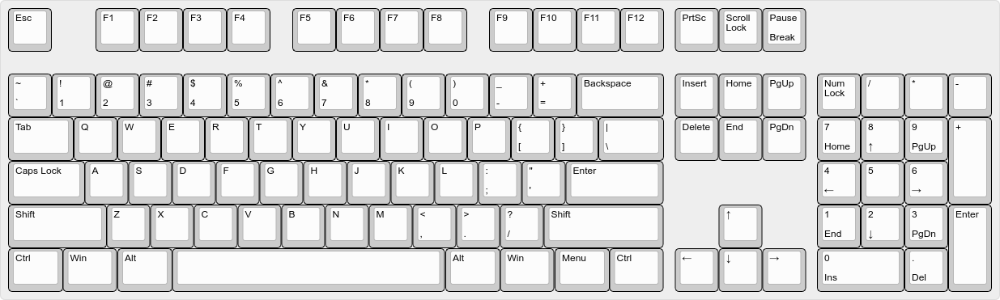

它的主键区有5行共61键，宽1500单位。底行有8键，左三右四同宽125，空格宽625。

它的最大问题是太宽了。通常认为数字键区对金融、财会相关专业人员帮助巨大，其余人群较少触及。

因此，将`ANSI 104`的数字键区去掉，即为常见的87键键盘。

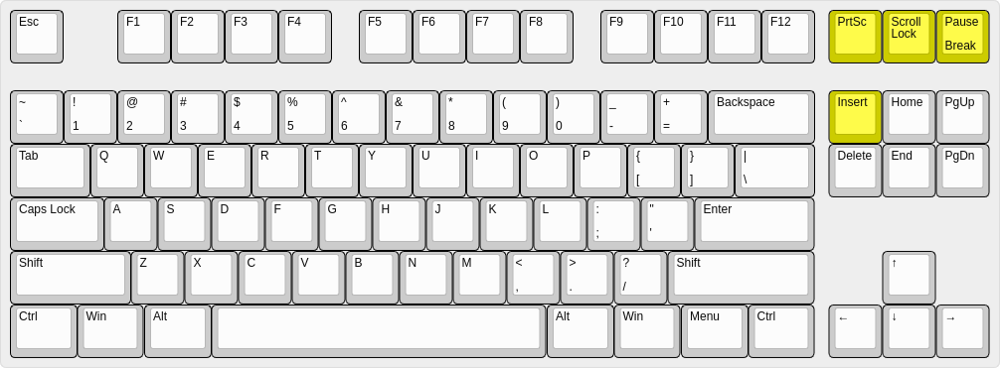

这种87键盘在「键」上还不够精简。`Scroll Lock`/`Pause/Break`/`Insert`这三个键估计只有误触才会按到。`Print Screen`不论其原始设计意图如何，现在多半映射到截屏。然而截屏这个动作虽然重要，却没那么高频，配个组合键已经足够。

`PageUp`/`PageDown`在浏览时很方便。`Home`/`End`在编辑时跳转到行首和行尾，常用。`Delete`和方向键更不用多说。

于是，一些设计会删去几个，补充几个，形成矩型的84键键盘。这个设计已经比较实用了，因为添加了一个新的修饰键`Fn`。

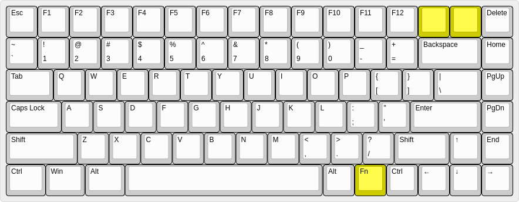

`Fn`凭空创造了一个「层」，相当好地支援了多媒体、操作系统特色功能和键盘本身的特性，如音量、播放、键盘背光、蓝牙搜寻等等。这里`Fn`不算创举，因为所有的笔记本键盘早就都有`Fn`了。实际上，将`Fn`放在右手区域是想像力不足的表现。

若想把键盘做小，这个84键提供了可行的思路：
- 团结在`ANSI 104`的主键区周围
- 减一些，加一些，改一些
- 善用`Fn`

回看`ANSI 104`的主键盘区本身，有两个问题略隐蔽：
- 右手区域过大。`Backspace`/`\`/`Enter`/`Shift`这几个键的右侧很少被触及。在使用很久的键盘上，这几个位置没有触摸痕迹，甚至厚灰已久。
- 空格右边的四个功修饰键很少使用。

这些问题肯定早已有人思考过。可以从著名键盘中获得灵感。

### flico minila 67

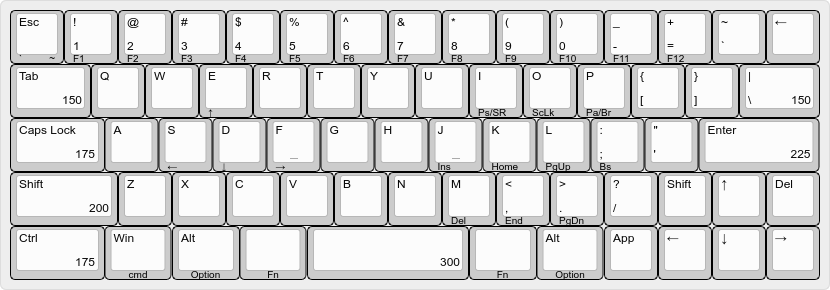

- 左右手`Fn`，因而缩水的`Space`
- 无处安放的、冗余的`` ` ``以及缩水的、冗余的`Backspace`
- 左右手方向键
- 全残的多媒体
- `App`什么鬼

双手冗余不会好。削空格见仁见智。因为方向键，右边的`Shift`太短很难按，`Delete`像是凑数的，但不改键大小就是无解。反而是右上的`Backspace`类似于Hot corner，不会太难适应。

### hhkb pro2

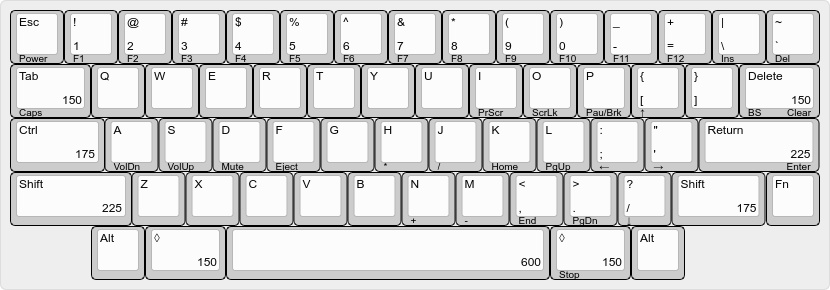

- 5行60键
- `|`/`` ` ``/`Delete`三人行
- 被权衡掉的`Caps Lock`
- 右手小指`Fn`，右手方向键
- 半残的多媒体

右手`Fn`会使食指脱离基本键，但又没有离太远，抽筋的感觉。`Delete`因长度而换位，不美且难用。`Ctrl`顶掉`Caps Lock`的确是亮点。缺角非常文艺。

### macbook air 2015

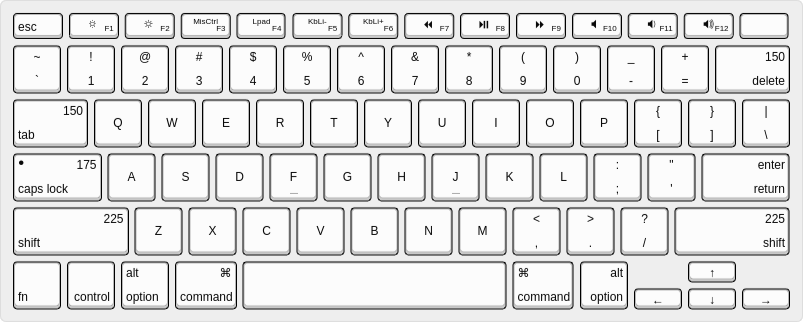

- 6行78键，宽1450
- 多媒体只在F区
- F区的键宽统一
- 用`delete`顶掉了`backspace`
- `caps lock`现在用于中/英切换，有灯诶
- `fn`组合键补足编辑区
- 后续版本`f4`/`f5`/`f6`改成了`Find`/`MicMute`/`Focus`，增加了`fn`锁

苹果是非常好的老师。它发现了主键区右侧的问题，并且取消了不常用的键。但在编辑键这里有些混乱。
- `fn+左`产生`home`，移动窗口到页首。`end`类似。
- 同样是「页首」，方向键用的是「上」：`command+上`，移动光标到页首
- 我们关心的与Windows行为一致的`Home`：`command+左`，移动光标到行首
- `Insert`键根本不存在。

### Thinkpad T450s

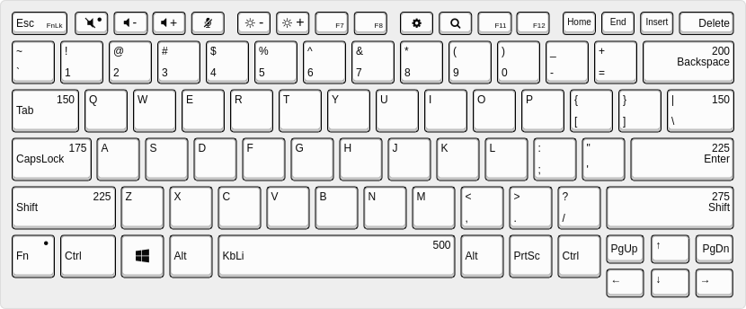

- 6行84键
- 右上`Delete`好评
- 最大限度地保留了编辑键
- 有`PrtSc`
- `Fn`有锁

有争议的键都保留了。真要说什么，可以把右`Ctrl`位置划成上下排的`PgUp`/`PgDn`，现有的位置则填入`Home`/`End`。

## 配列

理想中的配列应该是矩形，在损失轻微易用性的基础上，尽量少的键。
- 配列中保留F区基本上可以避免键位里所有的两难选择。
- 必须有实体方向键。最好有实体`Delete`。
- 左`Shift`宽225不可缩减。游戏时用到左半，打字时用到右半。
- 左`Fn`是必须的。如此，左手键区可用于游戏宏，也可支持单手操作媒体。
- `FnR`与`Fn`是不一样的键，如此，可再增加一层。允许`FnR`本身映射到别的键。
- 游戏时需要`Space`尽量靠左，打字时需要左`Alt`尽量靠右。
- 右侧底部的修饰键酌情省略。右`Shift`酌情让出1u。
- 需要有`Fn`锁。

闭眼画了一版，基本就是苹果键盘的样子。

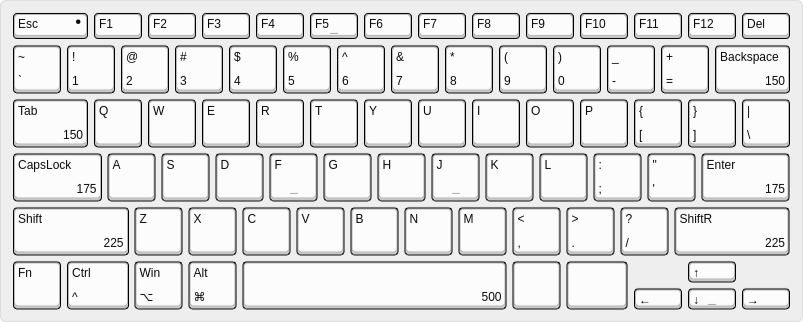

`Fn`与上下左右产生`PageUp`/`PageDown`/`Home`(windows)/`End`(windows)。
`Win`+`ArrowUp`映射到`select-window`，`Win`+`ArrowDown`映射到`select-workspace`，不过这应该是操作系统层面的设置。

目前可以DIY配列的都是机械键盘。机械键的物理形态限制了它最小宽度1u。
如果不切断右`Shift`，方向键只能用vim的hjkl排列。

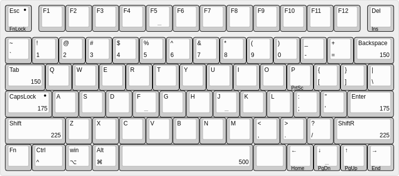

想要做得更小，无非是重新映射`Fn`的组合键。此时`FnLock`就可以取消了。

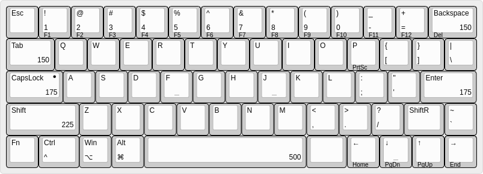

因为宽度定了1450，PCB、定位板、外壳免不了都要定制。之后，还有空格键的问题。
机械键盘每行键高不等，`Shift`/`Ctrl`这两行是R1，`Backspace`和`Esc`这两行是R4。
R1上常见1u/1.25u/2u/2.25u/2.75u/6.25u，少见1.75u/3u/6u。

若连模具都不想改，也不是不可以。
`CapsLock`让位于`Fn`。如果硬件或者板载程序能侦测双击的话，用双击`Fn`来触发`CapsLock`是一个很好的选择。

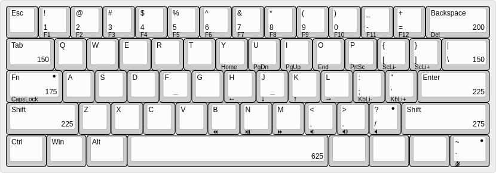

### 改键

对于紧凑型键盘来说，改键是个很强的需求。这涉及与操作系统的对接。比如对于「Play/Pause」这个功能，`windows`只关心有没有收到`VK_MEDIA_PLAY_PAUSE`，而`macos`收到`fn`+`f8`时发现这个组个键的意图是「Play/Pause」，因而触发相应动作。但无论如何，键盘只应在自己的输出值域内做映射。

## 配列之外

理想的键盘有很一些特性：
- 物理开关，模式切换，操作系统切换，蓝牙搜索，电量显示等
- 有辨识度和设计感的配色(黑白蓝)
- 键帽微内凹，空格键微外凸。参考Thinkpad笔记本键盘
- 三模
  - 有线：接线时充电。若为数据线，切换至有线模式
  - 有线：键线分离，usb type-c
  - 有线：线槽有左右前三个出口
  - 有线：键盘右侧有两个usb type-a母口。之一支持5Gbps，接外部存储。另一可外接鼠标、数字键盘等
  - 2.4GHz无线：有usb接收器收纳槽。高回报率
  - 蓝牙：采用最成熟的芯片，不用追求最新。低丢包率
  - 电池用常见的扁平手机电池4000mAh，或考虑7号电池
- 足够的桌面摩擦力
- 腕托

## 参考资料

https://ydkb.io/help/#/
https://github.com/ydkb
https://github.com/ydkb/ydkb.github.io
https://qmk.fm/
https://github.com/tmk/tmk_keyboard
gh60
gk61
dz60

□
